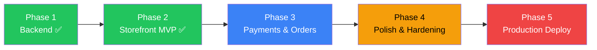

# Campifrut SOTA E-Commerce — Master Implementation Plan

**Stack**: Next.js 16 · Medusa.js v2 · Supabase · Tailwind v4 · Dokploy/Contabo
**Architecture**: Headless SaaS-managed e-commerce — todas las features gobernadas por feature flags

---

## Phase 1: Backend Foundation ✅

> All complete. No changes needed.

| Step | What | Status |
|------|------|--------|
| 1 | Supabase Schema (config, feature_flags, plan_limits, cms_pages, profiles, carousel_slides, analytics_events) | ✅ |
| 2 | Verify Medusa ↔ Supabase DB Connection | ✅ |
| 3 | Supabase Auth Provider (Medusa custom module) | ✅ |
| 4 | Supabase Storage Provider (Medusa custom module) | ✅ |
| 5 | Campifrut Seed Script (13 products, 5 categories) | ✅ |

---

## Phase 2: Storefront MVP (SOTA Enhanced) ✅

### Step 1b: Supabase Migrations ✅

> Applied. feature_flags has 4 new columns and whatsapp_templates table exists with seed data.

---

### Step 6: Lib Layer + Caching Strategy

**Install**: `@supabase/supabase-js`, `@supabase/ssr`, `lucide-react`

| File | Purpose |
|------|---------|
| [MODIFY] `package.json` | Add 3 dependencies |
| [MODIFY] `next.config.ts` | `output: 'standalone'`, image remotePatterns (Supabase CDN), ISR staleTimes |
| [NEW] `src/lib/supabase/client.ts` | Browser client via `createBrowserClient()` |
| [NEW] `src/lib/supabase/server.ts` | Server client via `createServerClient()` with cookie management |
| [NEW] `src/lib/medusa/client.ts` | Typed API fetcher with retry logic (1 retry, 3s timeout), graceful degradation. Methods: `getProducts()`, `getProduct(handle)`, `getCategories()`, `getCart()`, `createCart()`, `addToCart()`, `removeFromCart()`, `updateCartItem()` |
| [NEW] `src/lib/config.ts` | `getConfig()` — fetches config + flags + limits from Supabase, **in-memory TTL cache** (5 min). Includes `revalidateConfig()` Server Action. Note: `unstable_cache` removed due to `cookies()` conflict in Next.js 16 |
| [NEW] `src/lib/features.ts` | `isFeatureEnabled(flags, flag)` — type-safe flag check |
| [NEW] `src/lib/limits.ts` | `checkLimit(limits, resource, count)` → `{ allowed, remaining }` |
| [NEW] `src/lib/payment-methods.ts` | Payment method registry with flag mapping + `getEnabledMethods(flags)` |
| [NEW] `src/proxy.ts` | Next.js 16 proxy — session refresh, route protection (public/conditional/protected) |

**Rendering Strategy** (updated Feb 2026):

| Data | Strategy | Details |
|------|----------|--------|
| Config + flags + limits | In-memory TTL cache | 5 min, bustable via `revalidateConfig()` |
| Product list | `force-dynamic` | Rendered on-demand at runtime |
| Product detail | `force-dynamic` | Rendered on-demand at runtime |
| Categories | Fetched at request time | Via Medusa API |
| Cart | No cache (real-time) | Direct API calls |

---

### Step 7: SOTA Design System & Layout

**Design pillars**: Dynamic theming · Glassmorphism · Micro-animations · Inter + Outfit fonts · Dark mode

| File | Purpose |
|------|---------|
| [MODIFY] `globals.css` | Full design system: `@theme inline` with `--config-*` vars, surface layers, `.glass`/`.glass-strong`, `.product-card` hover lift, `.btn-primary`/`.btn-whatsapp`, skeleton shimmer, dark mode tokens, responsive utils |
| [MODIFY] `layout.tsx` | Server Component: `getConfig()` → inject CSS vars on `<html>`, load fonts, wrap in `<Header>` + `<Footer>` + `<CartProvider>` + `<Toaster>` |
| [MODIFY] `page.tsx` | Homepage with **Suspense-streamed sections** (🆕): Hero → `<Suspense>` CategoryGrid → `<Suspense>` FeaturedProducts → TrustSection → WhatsApp CTA |
| [NEW] `Header.tsx` | Glassmorphism sticky header: logo, nav, cart badge (pulse animation), auth button, mobile hamburger drawer, WhatsApp floating CTA |
| [NEW] `Footer.tsx` | Business info from config, social links, "Powered by BootandStrap" |
| [NEW] `Toaster.tsx` 🆕 | Portal-based toast system: `useToast().success()`, auto-dismiss, slide animations |
| [NEW] `Skeleton.tsx` 🆕 | `SkeletonCard`, `SkeletonText`, `SkeletonImage` with CSS shimmer |
| [NEW] `ErrorBoundary.tsx` 🆕 | Reusable client error boundary wrapper with retry |
| [NEW] `loading.tsx` (root) 🆕 | Root loading skeleton (first paint) |
| [NEW] `error.tsx` 🆕 | Global error page with retry button |
| [NEW] `not-found.tsx` 🆕 | Custom 404 with search + navigation |

---

### Step 8: Product & Cart Pages

#### Products

| File | Purpose |
|------|---------|
| [NEW] `productos/page.tsx` | Server Component, URL-driven state (`?category=&sort=&q=`), ISR `revalidate: 60` |
| [NEW] `productos/[handle]/page.tsx` | PDP: image gallery, price, variants, `<AddToCartButton>`, delivery info, related products, `generateMetadata()` with OG + JSON-LD Product 🆕 |
| [NEW] `productos/loading.tsx` 🆕 | Skeleton grid for products route |
| [NEW] `productos/[handle]/loading.tsx` 🆕 | Skeleton for PDP |
| [NEW] `productos/error.tsx` 🆕 | Graceful error if Medusa down (shows cached ISR data) |
| [NEW] `ProductGrid.tsx` | SOTA filtering: faceted categories, price range, multi-sort, instant search (300ms debounce), infinite scroll (`IntersectionObserver`), URL state, view modes, active filter pills, result count, empty state |
| [NEW] `ProductCard.tsx` | Glass card: `next/image`, category badge, price, hover lift + shadow, quick-add button, skeleton variant |
| [NEW] `AddToCartButton.tsx` | `useActionState()` + `useOptimistic()`, success toast + cart badge pulse, fly animation 🆕 |

#### Cart

| File | Purpose |
|------|---------|
| [NEW] `CartContext.tsx` | React Context: cart state, `localStorage` cartId, optimistic updates, drawer state |
| [NEW] `cart/actions.ts` | Server Actions: `createCart()`, `addToCart()`, `removeFromCart()`, `updateCartQuantity()`, `getCart()` |
| [NEW] `carrito/page.tsx` | Cart page: line items, order summary (delivery fee, free threshold), `<PaymentMethodSelector>`, empty state |
| [NEW] `carrito/loading.tsx` 🆕 | Cart skeleton |
| [NEW] `CartDrawer.tsx` 🆕 | Slide-from-right drawer: items, subtotal, "Ver carrito" + "Checkout" CTAs. Opens on add-to-cart |

#### SEO 🆕

| File | Purpose |
|------|---------|
| [NEW] `src/lib/seo/jsonld.ts` | Builders: `productJsonLD()`, `organizationJsonLD()`, `breadcrumbJsonLD()` |
| [NEW] `src/app/sitemap.ts` | Dynamic sitemap from Medusa products + categories |
| [NEW] `src/app/robots.ts` | Allow crawling, block `/api/`, `/auth/`, `/cuenta/` |

---

### Step 9: Auth Pages

| File | Purpose |
|------|---------|
| [NEW] `login/page.tsx` | Flag-driven providers: Google OAuth (if `enable_google_auth`), email/password (if `enable_email_auth`). Redirect support. Error toasts |
| [NEW] `registro/page.tsx` | Gated by `enable_user_registration`. Checks `plan_limits.max_customers`. Terms checkbox |
| [NEW] `auth/callback/route.ts` | OAuth callback handler: code → session exchange → redirect |
| [NEW] `AuthProviders.tsx` | Shared component: OAuth buttons + email form + divider, loading states |

---

### Step 10: WhatsApp Checkout & Order Confirmation

| File | Purpose |
|------|---------|
| [NEW] `template-engine.ts` | `parseTemplate()` — `{{var}}`, `{{#each}}`, `{{#if}}` support. `buildWhatsAppUrl()` |
| [NEW] `buildMessage.ts` | Cart → WhatsApp message using Supabase template + config currency |
| [NEW] `WhatsAppCheckoutFlow.tsx` | Step flow: customer info form → message preview → "Enviar por WhatsApp" → success. **Guest checkout** supported (no login required) 🆕 |
| [NEW] `PaymentMethodSelector.tsx` | Smart UI: 1 method → full button, 2 → side-by-side, 3+ → primary + dropdown |
| [NEW] `CheckoutModal.tsx` | Full-screen mobile / modal desktop: address form, payment flow, order summary. Progress indicator 🆕 |
| [NEW] `pedido/[id]/page.tsx` 🆕 | Order confirmation page with summary after checkout |

---

### Phase 2 File Summary

| Category | Files |
|----------|-------|
| Supabase migrations | 2 ✅ |
| New files | **40** |
| Modified files | **5** (`package.json`, `next.config.ts`, `globals.css`, `layout.tsx`, `page.tsx`) |

---

## Phase 3: Payments & Orders

### Step 11: Stripe Payment Integration

| File | Purpose |
|------|---------|
| [MODIFY] `medusa-config.ts` | Add Stripe payment provider with API key from env |
| [NEW] `StripeCheckoutFlow.tsx` | Stripe Elements embedded in `CheckoutModal`: card input, processing state, 3D Secure handling |
| [NEW] `src/lib/stripe/actions.ts` | Server Actions: `createPaymentIntent()`, `confirmPayment()`, `handleWebhook()` |
| [NEW] `src/app/api/webhooks/stripe/route.ts` | Stripe webhook handler: payment_intent.succeeded → update Medusa order status |
| [NEW] `BankTransferFlow.tsx` | Show bank details + copy to clipboard. Upload proof of payment (Supabase Storage) |

### Step 12: Account & Orders Dashboard

| File | Purpose |
|------|---------|
| [NEW] `cuenta/page.tsx` | Account dashboard: profile info, recent orders, quick actions |
| [NEW] `cuenta/pedidos/page.tsx` | Full order history with status badges + pagination |
| [NEW] `cuenta/pedidos/[id]/page.tsx` | Order detail: timeline, items, payment status, reorder button |
| [NEW] `cuenta/perfil/page.tsx` | Edit profile: name, email, phone, address. Change password |
| [NEW] `cuenta/layout.tsx` | Account layout with sidebar navigation |
| [NEW] `OrderTimeline.tsx` | Visual timeline: pending → confirmed → processing → shipped → delivered |
| [NEW] `pedido/buscar/page.tsx` | Guest order lookup: email + order number → view status |

---

## Phase 4: Polish & Hardening

### Step 13: SEO, Performance & Accessibility

| Task | Details |
|------|---------|
| Lighthouse audit | Target ≥90 on all 4 categories |
| Image optimization | `next/image` Supabase loader, WebP format, lazy loading |
| Font optimization | `next/font` for Inter + Outfit, preload critical |
| Core Web Vitals | LCP < 2.5s, FID < 100ms, CLS < 0.1 |

### Step 14: CMS, Carousel & Analytics

| File | Purpose |
|------|---------|
| [NEW] `cms/[slug]/page.tsx` | CMS page renderer from Supabase `cms_pages` |
| [NEW] `CarouselSection.tsx` | Hero carousel from `carousel_slides` (if `enable_carousel`) |
| [NEW] `src/lib/analytics/track.ts` | Event tracking → Supabase `analytics_events` |

### Step 14b: Transactional Emails 🆕

| File | Purpose |
|------|---------|
| [NEW] `supabase/functions/send-order-email/index.ts` | Edge Function: sends via Resend |
| [NEW] `src/lib/email/templates.ts` | HTML email templates |

### Step 14c: Admin Storefront Controls 🆕

| File | Purpose |
|------|---------|
| [NEW] `src/app/api/revalidate/route.ts` | API route to trigger ISR revalidation |

---

## Phase 5: Production Deploy

### Step 15: Dokploy on Contabo VPS

Docker + Docker Compose + Dokploy setup + domain + SSL

### Step 15b: Production Infrastructure 🆕

Rate limiting, CSP headers, health endpoint, Redis modules

### Step 15c: Pre-Launch Checklist

Build, flags tested, WhatsApp flow, mobile responsive, SEO, Lighthouse ≥90, security

---

## Total Project Metrics

| Phase | New Files | Modified | Migrations | Edge Functions |
|-------|-----------|----------|------------|----------------|
| 1 ✅ | — | — | 7 | 0 |
| 2 | 40 | 5 | 2 ✅ | 0 |
| 3 | 12 | 1 | 0 | 0 |
| 4 | 8 | 1 | 1 | 1 |
| 5 | 1 | 3 | 0 | 0 |
| **Total** | **61** | **10** | **10** | **1** |
