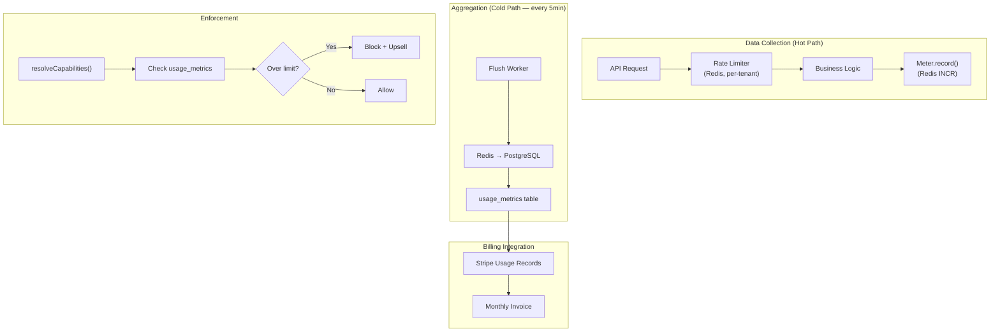

# MeteringEngine Design Document

> **Status**: 📌 FUTURE — Implement when >50 tenants
> **Author**: Platform Architecture Team
> **Last Updated**: 2026-04-08

---

## Problem Statement

As the tenant base grows (>50), we need to:
1. **Track resource consumption** per tenant (API calls, storage, email sends, orders)
2. **Enforce limits in real-time** (not just at governance layer)
3. **Enable usage-based billing** (Stripe metered subscriptions)
4. **Protect infrastructure** from noisy neighbors (rate limiting)

Currently, `plan_limits` defines thresholds but enforcement is only at the application layer
(e.g., `max_products` is checked on product creation). There's no infra-level metering.

---

## Architecture



---

## Database Schema

```sql
-- usage_metrics: Aggregated usage data (flushed from Redis)
CREATE TABLE usage_metrics (
    id UUID PRIMARY KEY DEFAULT gen_random_uuid(),
    tenant_id UUID NOT NULL REFERENCES tenants(id),
    metric TEXT NOT NULL,           -- 'api_requests', 'storage_mb', etc.
    value BIGINT NOT NULL,          -- Counter value
    billing_period TEXT NOT NULL,   -- '2026-04' (YYYY-MM)
    recorded_at TIMESTAMPTZ DEFAULT now(),
    
    -- Unique per tenant+metric+period for upsert
    UNIQUE(tenant_id, metric, billing_period)
);

CREATE INDEX idx_usage_metrics_tenant 
    ON usage_metrics(tenant_id, billing_period);

-- Enable RLS
ALTER TABLE usage_metrics ENABLE ROW LEVEL SECURITY;
```

---

## Meterable Resources

| Metric | Type | Limit Source | Enforcement |
|--------|------|-------------|-------------|
| `api_requests` | Counter/day | `max_requests_day` | Redis rate limiter |
| `storage_mb` | Gauge | `max_storage_mb` | Pre-upload check |
| `email_sends` | Counter/month | `max_emails_month` | Email service check |
| `chatbot_messages` | Counter/month | `max_chatbot_messages` | Chatbot service check |
| `orders` | Counter/month | `max_orders_month` | Order creation check |
| `products` | Gauge | `max_products` | Product creation check |
| `pos_transactions` | Counter/month | `max_pos_transactions` | POS terminal check |

---

## Redis Buffer Pattern

```typescript
// HOT PATH: Record metric (sync, <1ms)
class MeteringEngine {
    private redis: Redis
    
    async record(tenantId: string, metric: string, increment = 1): Promise<void> {
        const period = this.currentPeriod() // '2026-04'
        const key = `meter:${tenantId}:${metric}:${period}`
        
        await this.redis.incrby(key, increment)
        // Set TTL to end of billing period + 7 days buffer
        await this.redis.expire(key, this.secondsUntilEndOfPeriod() + 604800)
    }
    
    async checkLimit(tenantId: string, metric: string): Promise<{
        allowed: boolean
        current: number
        limit: number
        percentUsed: number
    }> {
        const period = this.currentPeriod()
        const key = `meter:${tenantId}:${metric}:${period}`
        
        const current = await this.redis.get(key) ?? 0
        const limit = await this.getLimitFromGovernance(tenantId, metric)
        
        return {
            allowed: current < limit,
            current: Number(current),
            limit,
            percentUsed: limit > 0 ? (Number(current) / limit) * 100 : 0,
        }
    }
}
```

---

## Flush Worker

```typescript
// COLD PATH: Every 5 min, flush Redis counters to PostgreSQL
// Runs as a periodic job via async_jobs
async function flushMetrics(): Promise<void> {
    const keys = await redis.keys('meter:*')
    
    for (const key of keys) {
        const [, tenantId, metric, period] = key.split(':')
        const value = await redis.get(key)
        
        // Upsert into usage_metrics
        await supabase.from('usage_metrics').upsert({
            tenant_id: tenantId,
            metric,
            value: Number(value),
            billing_period: period,
        }, {
            onConflict: 'tenant_id,metric,billing_period'
        })
    }
}
```

---

## Stripe Usage-Based Billing Integration

```typescript
// Monthly: Report usage to Stripe for metered subscriptions
async function reportUsageToStripe(tenantId: string): Promise<void> {
    const period = previousPeriod() // Last complete month
    
    const metrics = await supabase
        .from('usage_metrics')
        .select('metric, value')
        .eq('tenant_id', tenantId)
        .eq('billing_period', period)
    
    for (const m of metrics.data ?? []) {
        // Only report metrics that are metered in Stripe
        const subscriptionItemId = await getMeteredSubscriptionItem(tenantId, m.metric)
        if (!subscriptionItemId) continue
        
        await stripe.subscriptionItems.createUsageRecord(subscriptionItemId, {
            quantity: m.value,
            timestamp: Math.floor(Date.now() / 1000),
            action: 'set', // Not increment — we report absolute totals
        })
    }
}
```

---

## Threshold Alerts

When usage hits 80% or 100% of a limit:
1. Log to `tenant_errors` (visible in SuperAdmin)
2. Send notification to tenant owner (email)
3. Show warning banner in Owner Panel
4. At 100%: enforce soft block (upsell modal, allow override for grace period)

---

## Implementation Phases

| Phase | When | What |
|-------|------|------|
| **1** | >50 tenants | `usage_metrics` table + Redis buffer + flush worker |
| **2** | >100 tenants | Threshold alerts + Owner Panel usage dashboard |
| **3** | >200 tenants | Stripe metered billing integration |
| **4** | >500 tenants | Per-tenant rate limiting at infra level (nginx/Dokploy) |

---

## Dependencies

- Redis (already available via `./dev.sh` local stack)
- `usage_metrics` migration (Phase 1)
- Stripe metered subscription setup (Phase 3)
- Rate limiter middleware in storefront (Phase 4)

---

## Decision Log

| Date | Decision | Rationale |
|------|----------|-----------|
| 2026-04-08 | Postpone implementation | <50 tenants — application-level limits sufficient |
| 2026-04-08 | Redis buffer pattern | High-throughput writes (api_requests) can't go direct to PostgreSQL |
| 2026-04-08 | Stripe `set` not `increment` | Avoids double-counting if flush runs twice in same period |
